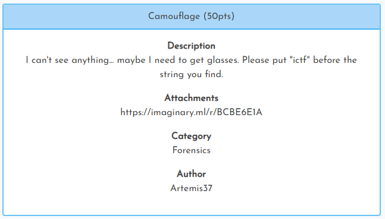
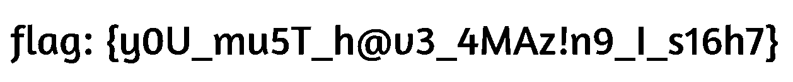

[< Back to All CTFs](https://github.com/KrisLloyd/Python/tree/master/CTF#ctf-solves)

[< Back to Imaginary CTF](https://github.com/KrisLloyd/Python/tree/master/CTF#imaginary-ctf-ongoing-2021)
***

# Camouflage



### Challenge:
##### I can't see anything... maybe I need to get glasses. Please put "ictf" before the string you find.
##### 50 Points
##### Attachments: https://imaginary.ml/r/BCBE6E1A

### Solve:

Using the link provided, it brings you to a black .png file. 


Since this is a forensics challenge, the obvious choice is to check the file for hidden strings or files. Using the **strings** method didnt provide any useful strings, and opening the file in a hex editor to inspect the file showed that there wasn't any hidden files.

Moving forward, I went to [StegOnline](https://stegonline.georgeom.net/upload) and loaded the image for bitplane inspection. 

The flag was hidden in the Blue LSB bit 0.




### Flag
```
ictf{y0U_mu5T_h@v3_4MAz!n9_I_s16h7}
```
