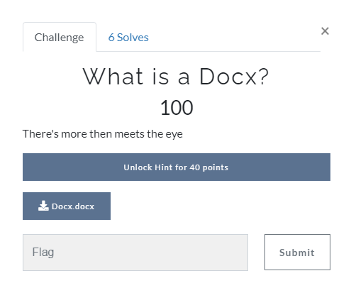
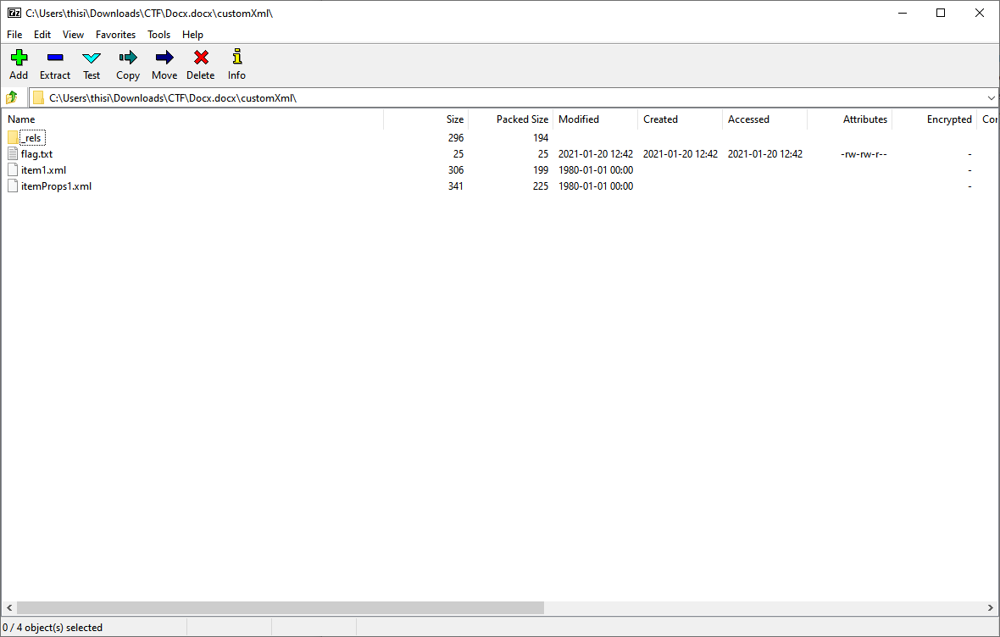

[< Back to All CTFs](https://github.com/KrisLloyd/Python/tree/master/CTF#ctf-solves)

[< Back to BIT Olympics CTF](https://github.com/KrisLloyd/Python/tree/master/CTF#bit-olymipcs-march-2021)
***

# What is a Docx?



### Challenge:
##### There's more then meets the eye
##### 100 Points
##### Files: [Docx.docx](Docx.docx)

### Solve:

The standard Microsoft .\*\*\*x files such as docx (Word) and xlsx (Excel) among others are simply an archive container format that contain everything needed to represent the file in in the program.

Knowing this, my first step was to inspect the document as an archive to see if there were any hidden documents that were contained within. Looking in the **customXml** subfolder revealed a text file that contained the flag



### Flag
```
flag{docx_1s_JU57_4_z1P}
```
