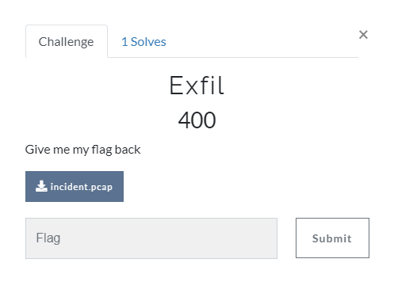
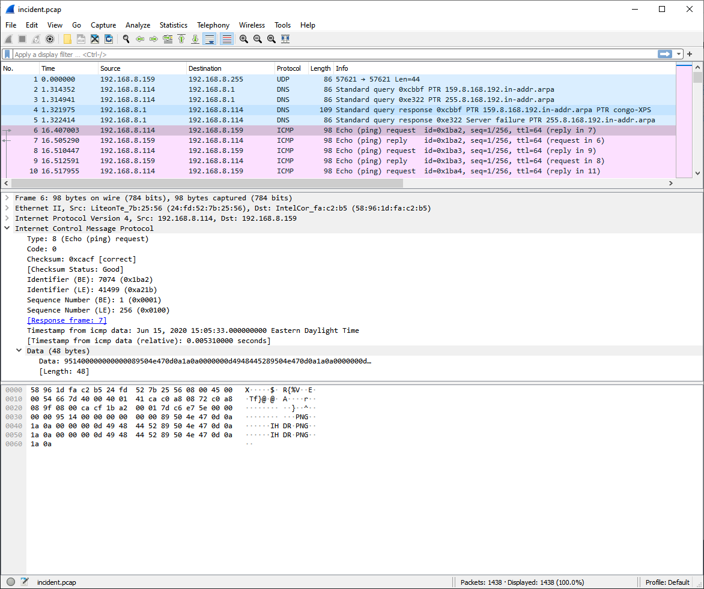

[< Back to All CTFs](https://github.com/KrisLloyd/Python/tree/master/CTF#ctf-solves)

[< Back to BIT Olympics CTF](https://github.com/KrisLloyd/Python/tree/master/CTF#bit-olymipcs-march-2021)
***

# Exfil



### Challenge:
##### Give me my flag back
##### 400 Points
##### Files: [incident.pcap](incident.pcap)

### Solve:

Opening the pcap file in Wireshark revealed a series of PING messages from hosts 192.168.1.114 and 192.168.1.159. Digging into the ICMP packet, it was clear that the data payload contained some valuable information. The first ICMP request from 192.168.1.114 contained a data payload that suggested that a PNG file was split amongst the 1433 ping requests.



The next step was to try and extract the data payload from the pcap file. I wrote a quick script in python to do this.

```python
from scapy.all import *
import base64


print("Program started.")
capture = rdpcap('Incident.pcap')
ping_data = ""

with open('out.png', 'ab') as file:

    for packet in capture:
        try:
            if packet[IP].src == '192.168.8.114':
                if packet.haslayer(ICMP):
                    x = bytes.fromhex(packet.load.hex()[32:64])
                    file.write(x)
        except IndexError:
            continue


print("Program finished.")
```

One issue with the first draft of the script was that when the output file was generated, it was not building the file properly. An error popped up when trying to open the resulting image file. Closer inspection of the payload showed that the information was being split and duplicated in the payload to obfuscate the data. I examined the payload and compared the content with a standard PNG header to determine the specific bytes from the payload and wrote them to file. 

With the corect bytes selected, the image file was sucessfully written, and I was able to obtain the flag shown below:.


### Flag
```
flag{not_so_stealthy_exfil}
```
