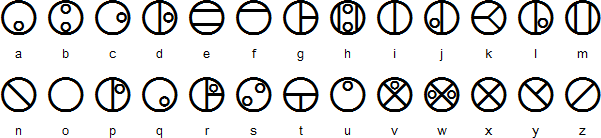
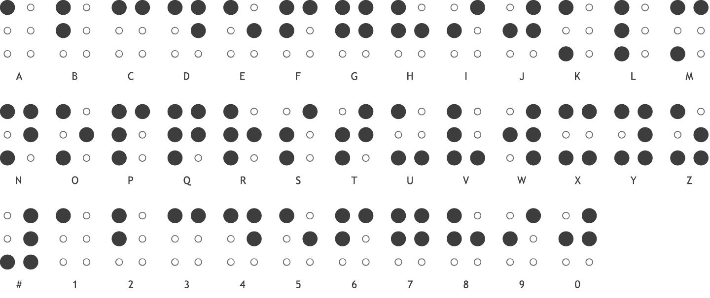
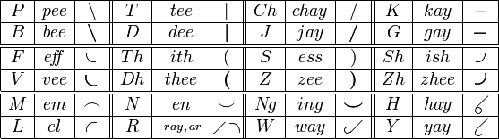

[< Back to CTF Main](https://github.com/KrisLloyd/CTF#ctf-solves)
***


# CTF Guide

Common CTF challenges, and how to approach them.

### Index

* [ELF Files](https://github.com/KrisLloyd/CTF/tree/main/Guide#elf-files-pwn)
* [Images](https://github.com/KrisLloyd/CTF/tree/main/Guide#image-files-stego)
* [Ciphers](https://github.com/KrisLloyd/CTF/tree/main/Guide#ciphers)
* [Hashes](https://github.com/KrisLloyd/CTF/tree/main/Guide#hashes)

<br></br>

### Windows Alternate Data Streams (STEGO)

To Do: 
- Complete this section
- Add in section references

Check for files with ADS in Windows:
dir /R


### ELF Files (PWN)

#### About

Executable and Linkable Format - A binary executable file built from c code.

An ELF binary is comprised of different sections, headers, sections, and segments.


**Headers** section contains metadata about the program and helps the process of execution.
**Sections** contain the **.text**, **.data** sections. These sections are where the code and variables are stored.

source code file:
```c
File: hello.c

#include <stdio.h>

int main() {
  printf("Hello world!");
  return 0;
}
```

Compile the file using **gcc**
```bash
kali@kali:~# gcc hello.c -o hello
```

run the binary
```bash
kali@kali:~# ./hello
Hello world!
```

#### Techniques

1. Check for printable strings in the exectable:
  `strings ./hello`
2. Check a hex dump of the file:
  `xxd ./hello`
4. Use **readelf** to explore the file sections:
  `readelf <option flag> ./hello`
5. Read the MAN pages for any function to understand how it operates:
  `man execvp`
  
  
<br></br>
### Image Files (Stego)

Hidden messages in image files

1. If the image doesn't open, check the filetype and change extension if necessary
  `file image.png`
2. Load the image into [StegOnline](https://stegonline.georgeom.net/upload) and browse bit planes
3. Use the **strings** command to print any printable strings
  `strings image.png`
4. Check if there is anything hidden in the image EXIF metadata
  `exiftool image.png`
5. Load the imaage into the online EXIF tool [Jeffrey's Image Metadata Viewer](http://exif.regex.info/exif.cgi)
6. Check for embedded files with binwalk
  `binwalk -Me image.png`
7. Fix any corrupted chunks with pngcheck (-v verbose, -t7 text chunks, -p display other chunk content, -f force)
  `pngcheck -vt7pf image.png`

<br></br>

### Lost Files from an Image file (dd, Safeback, Encase, etc.)
Recover lost files with **foremost**

```bash
kali@kali:~# foremost -t doc,jpg,pdf,xls -i image.dd
```
  
  
<br></br>
### Ciphers

* Pigpen:

  

* Matoran (bionicle):

  
  * [Decoder](https://lingojam.com/MatoranAlphabet)

* Standard Galactic Alphabet (Commander Keen / Minecraft):

  
  * [Decoder](https://www.dcode.fr/standard-galactic-alphabet)

* Hexahue:

  
  * [Decoder](https://www.dcode.fr/hexahue-cipher)

* Alienese (Futurama):

  
  * [Decoder](https://alienese.moxievillelabs.com/)

  
  * [Alien Language 2 Decoder](http://www.gotfuturama.com/Interactive/AlienCodec/)

* Braille:

  
  * [Decoder](https://www.brailletranslator.org/)


* Pitman Shorthand:

  
  * [Encoder only](https://steno.tu-clausthal.de/Pitman.php)
  * [Ask for help](https://www.reddit.com/r/shorthand/)


* Morse Code:

  
  * [Decoder](https://morsecode.world/international/translator.html)


* Bill Cipher (Gravity Falls):

  
  * [Decoder](https://www.dcode.fr/gravity-falls-bill-cipher)

<br></br>

### Hashes

Use [Crack Station](https://crackstation.net/) to solve a hash to recover the plaintext
