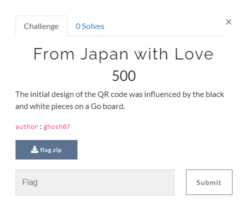
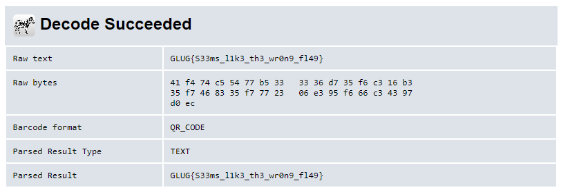
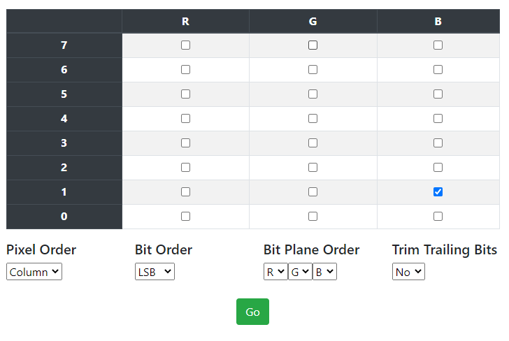

[< Back to All CTFs](https://github.com/KrisLloyd/Python/tree/master/CTF#ctf-solves)

[< Back to FooBar CTF](https://github.com/KrisLloyd/Python/tree/master/CTF#foobar-ctf-march-2021)
***

# From Japan with Love



### Challenge:
##### The initial design of the QR code was influenced by the black and white pieces on a Go board.
##### 500 Points
##### Files: [flag.zip](flag.zip)

### Solve:

The provided .zip contained a single **flag.mp4** which was not playable. Opening the file in a hex editor revieled that it reselmbled a PNG file, however the header was corrupted. I copied the PNG header from a random screen capture I had lying and overwrote the corrupted header, then renamed the file with a **.png** file extension. This gave me the image below:


Using an online [QR code decoder](https://zxing.org/w/decode.jspx) tool, I was able read the content.

Finally, the flag!



```
GLUG{S33ms_l1k3_th3_wr0n9_fl49}
```

Hmmm, seems suspecious. Turns out this ISN'T the flag I'm looking for, and that I have more digging to do!

The clue references the tabletop game **Go** where colours are flipped (though I don't really know the rules to Go). I tried inverting the QR code in hopes that it would provide something useful.


Sadly this didn't yield any results. Time to dig deeper, upnext is zsteg and foremost.

```bash
┌──(kali㉿kali)-[~/Japan]
└─$ zsteg flag.png     
[=] nothing :( 
```

Both tools came up empty. Asking for a hint from the content creator, I was given the hint "observe the pixels". This suggested it was a visual (or visual-type) solution, which brought me back to my favorite stego tool, [StegOnline](https://stegonline.georgeom.net/). Browsing the bit planes, there was unique data on Green 0, Blue 0, and Blue 1. You could see that there was a single column of pixels changing along the far right side. I extracted the data along the columns and examined the resulting data in a hex editor. 

[flag.dat](flag.dat)




The flag was at the very end of the hex file since it was the last column the program inspected.

### Flag
```
GLUG{t00_many_p1x3l5}
```
