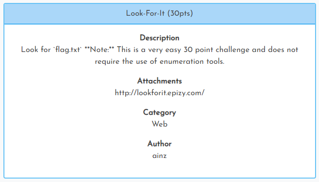

[< Back to All CTFs](https://github.com/KrisLloyd/Python/tree/master/CTF#ctf-solves)

[< Back to Imaginary CTF](https://github.com/KrisLloyd/Python/tree/master/CTF#imaginary-ctf-ongoing-2021)
***

# Look For It



### Challenge:
##### Look for \`flag.txt\`.
##### 30 Points
##### Attachments: http://lookforit.epizy.com/?page=home.html

### Solve:

Using the link provided, it brings you to the following page. 


Checking the tabs, there is also a link for an **about.html**. Both of these pages have very little in the HTML source and javascript. 

The clue references the **flag.txt** file, which should be in the root directory of the webserver. Changing the page request url to reference the web root, then adding the file name provided the answer for the flag:

```
http://lookforit.epizy.com/?page=home.html/../../flag.txt
```


### Flag
```
ictf{l00ked_f0r_it_&_found_w@ld0..._n0t_really}
```
