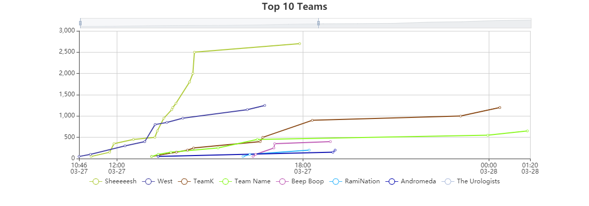
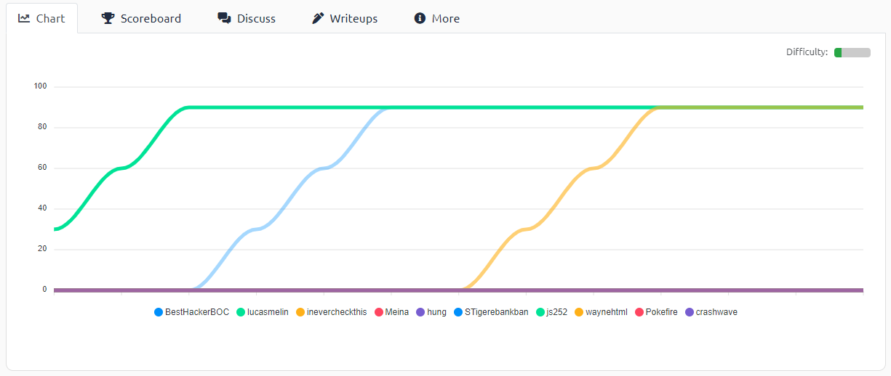

[< Back to About](https://github.com/KrisLloyd/About#about)
***
# CTF Guide

* [CTF Guide](https://github.com/KrisLloyd/CTF/tree/main/Guide#ctf-guide)

  A guide on how to approach CTF challenges.

  
# CTF Solves

### BIT Olymipcs (March 2021)

#### [ Results ]

* TeamK - 1200 Points (1 member)

#### [ Reverse Engineering ]

* [Ropes](./Ropes)

#### [ PWN ]

* [Overflow-0](./Overflow0)

#### [ Misc ]

* [What is Docx?](./Docx)
* [What's the code?](./WhatsTheCode)
* [Exfil](./Exfil)

#### [ Web ]

* [Sauce?](./Sauce)

#### [ Crypto ]

* [My first riot](./Riot)
* [My ex or me](./ExOrMe)
* [My Second Rot-i](./ROT-i)

  
### FooBar CTF (March 2021)

#### [ Misc ]
* [From Japan with Love](./Japan)

#### [ Forensics/Steg ]
* [Shots](./Shots)
* [Render](./Render)

  
### AE CTF - TryHackMe (April 2021)
#### [ Results ]

#### [ Web ]

* [Pickle Rick](./PickleRick)

  
### Imaginary CTF (Ongoing 2021)
#### [ Crypto ]

* [Rotations](./Rotations)
* [Countdown Baseball](./CountdownBaseball)

#### [ Forensics ]

* [Camouflage](./Camouflage)

#### [ Web ]
* [sources-adventure-hardened](./sources-adventure-hardened)
* [Look For It!](./LookForIt)

#### [ Pwn ]
* [&aaa](./aaa)
