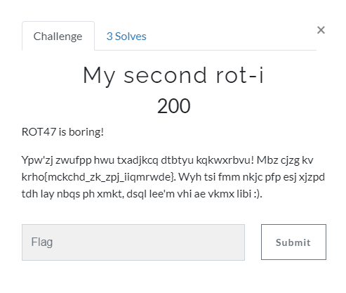

[< Back to All CTFs](https://github.com/KrisLloyd/CTF#ctf-solves)

[< Back to BIT Olympics CTF](https://github.com/KrisLloyd/CTF#bit-olymipcs-march-2021)
***

# ROT-i



### Challenge:
##### ROT47 is boring!
##### Ypw'zj zwufpp hwu txadjkcq dtbtyu kqkwxrbvu! Mbz cjzg kv krho{mckchd_zk_zpj_iiqmrwde}. Wyh tsi fmm nkjc pfp esj xjzpd tdh lay nbqs ph xmkt, dsql lee'm vhi ae vkmx libi :).
##### 200 Points

### Solve:

The title suggested that this is another ROT cipher, however using tools like CyberChef did not yield any useful results from the various ROT formulas available. I also attempted to use quipquip for a fast solve but that didn't have any usefuiil results either. I could see that the cipher text contained the flag, so I began a manual replacement of the letters starting with:

```
krho{mckchd_zk_zpj_iiqmrwde}  -->  flag{mckchd_zk_zpj_iiqmrwde}
```

Sadly after doing a simple letter replacement, it wasn't providing much help, despite knowing that those 4 letters were correct. I needed to figure out other possible solutions that would allow for these letters to somehow become true. This is when I figured out that the first word must be *You've*. Solving for this became painfully obvious when I realized the challenge was called rot-i, or in other words rotate i positions for the i'th character in the cipher text. It fit perfectly for the first section I decoded by hand:

```
Ypw'zj zwufpp hwu  -->  You've solved the
```
I wrote a python script that cycled through the cipher text and rotated each character the proper number of times, accounting for special characters (which added to the ROT count, but were not rotated themselves). The code simply finds the ASCII value for the current character, then decrements that value by *i* which is the position of that character in the ciphertext.

```python
ciphertext = "Ypw'zj zwufpp hwu txadjkcq dtbtyu kqkwxrbvu! Mbz cjzg kv krho{mckchd_zk_zpj_iiqmrwde}. Wyh tsi fmm nkjc pfp esj xjzpd tdh lay nbqs ph xmkt, dsql lee'm vhi ae vkmx libi"

def roti(s):
    x = []
    count = 0
    for i in range(len(s)):
        if s[i] in ["'", "!", "{", "}", "_", ".", ",", " "]:
            count += 1
            x.append(s[i])
            continue
        j = ord(s[i])
        if s[i].isupper():
            # ASCII 65 - 90
            for i in range(count):
                j -= 1
                if j == 64:
                    j = 90
            x.append(chr(j))
        else:
            # ASCII 97 - 122
            for i in range(count):
                j -= 1
                if j == 96:
                    j = 122
            x.append(chr(j))
        count += 1
    return ''.join(x)

print(roti(ciphertext))
```

The result printed out clearly:
```
You've solved the beginner crypto challenge! The flag is flag{crypto_is_fun_kjqlptzz}. Now get out some pen and paper for the rest of them, they won't all be this easy
```

### Flag

```
flag{crypto_is_fun_kjqlptzz}
```
