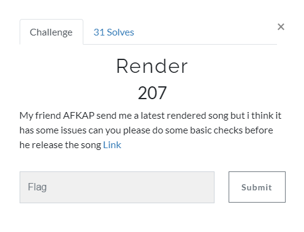
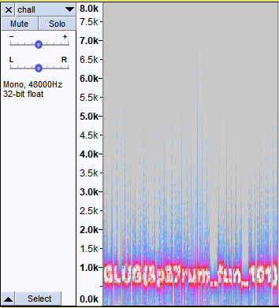

[< Back to All CTFs](https://github.com/KrisLloyd/CTF#ctf-solves)

[< Back to FooBar CTF](https://github.com/KrisLloyd/CTF#foobar-ctf-march-2021)
***

# Render



### Challenge:
##### My friend AFKAP send me a latest rendered song but i think it has some issues can you please do some basic checks before he release the song Link
##### 207 Points
##### Files: [chall.wav](chall.wav)

### Solve:

My first move was to listen to the file, I opened it in Audacity and listened to it. At the 2m8s mark, there is a distortion that interupts the song for approx 5 seconds. Most likely this is the flag, so I'll focus my efforts on this segment.

I isolated this segment as tried to resolve the wav to Moris code, howver the wavs didn't match any patterns.

I switched over to **Spectrogram** view and the flag was slightly visible. Adjusting for a cleaner view, the flag became more visible.



### Flag
```
GLUG{5p37rum_fun_101}
```
