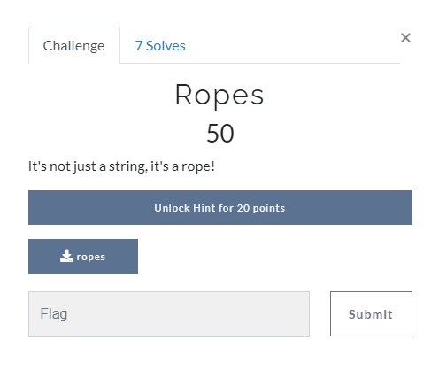

[< Back to All CTFs](https://github.com/KrisLloyd/Python/tree/master/CTF#ctf-solves)

[< Back to BIT Olympics CTF](https://github.com/KrisLloyd/Python/tree/master/CTF#bit-olymipcs-march-2021)
***

# Ropes



### Challenge:
##### It's not just a string, it's a rope!
##### 50 Points
##### Files: [ropes](ropes)

### Solve:

A simple scan of the strings in the file was enough to extract the flag

```
strings ropes

First part is: flag{r0pes_ar3_
Second part is: just_l0ng_str1ngs}
```

### Flag

```
flag{r0pes_ar3_just_l0ng_str1ngs}
```
