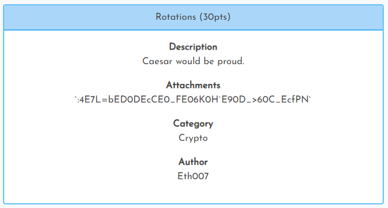

[< Back to All CTFs](https://github.com/KrisLloyd/CTF#ctf-solves)

[< Back to Imaginary CTF](https://github.com/KrisLloyd/CTF#imaginary-ctf-ongoing-2021)
***

# Rotations



### Challenge:
##### Caesar would be proud.
##### 30 Points
##### Attachments: :4E7L=bED0DEcCE0_FE06K0H\`E90D_>60C_EcfPN

### Solve:

Easy cipher to solve, putting the provided text into a rot47 solver provided the flag.


### Flag
```
ictf{l3ts_st4rt_0ut_ez_w1th_s0me_r0t47!}
```
