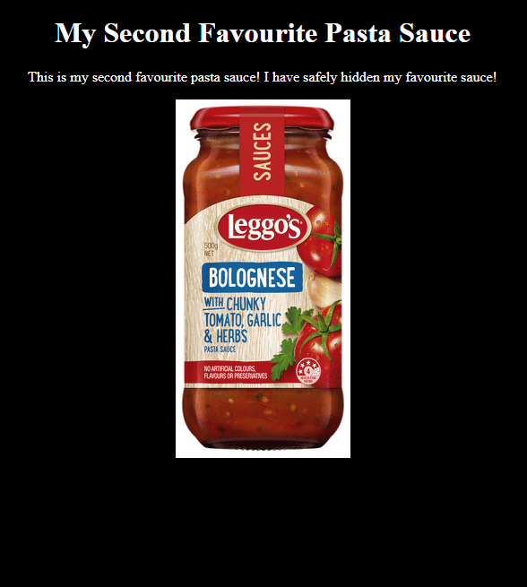

[< Back to All CTFs](https://github.com/KrisLloyd/CTF#ctf-solves)

[< Back to BIT Olympics CTF](https://github.com/KrisLloyd/CTF#bit-olymipcs-march-2021)
***

# Sauce?

### Challenge:
##### I love sauce! I won't tell you what my special secret sauce is though!
##### http://myctf.ca:10001
##### 50 Points


### Solve:

Connecting to the provided address, http://myctf.ca:10001, I was greeted with a seemingly bland and basic webpage. At face value, there wasn't much to go on outside of the challenge name, so I immediatly inspected the web page source code.



In the soucecode, there was basic HTML and a special javascript file that prevented right clicks. Digging deeper, I inspected the js sourcecode and found the hidden flag.

```javascript
document.addEventListener('contextmenu', function(e) {
    e.preventDefault();
    alert('not allowed');
});

  //the source reveals my favourite secret sauce 
  // flag{n0_k37chup_ju57_54uc3_r4w_54uc3_9873984579857}
```


### Flag
```
flag{n0_k37chup_ju57_54uc3_r4w_54uc3_9873984579857}
```
