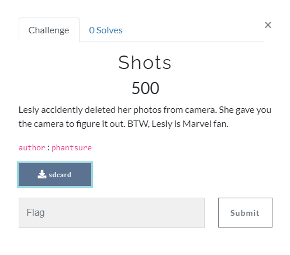

[< Back to All CTFs](https://github.com/KrisLloyd/Python/tree/master/CTF#ctf-solves)

[< Back to FooBar CTF](https://github.com/KrisLloyd/Python/tree/master/CTF#foobar-ctf-march-2021)
***

# Shots



### Challenge:
##### Lesly accidently deleted her photos from camera. She gave you the camera to figure it out. BTW, Lesly is Marvel fan.
##### 500 Points
##### Files: [sdcard](sdcard)

### Solve:

The file that comes with the challenge does not have an extension provided, however from context I was able to determine that it should be an **.iso** file. Addiing this extension to the file allowed me to open the archive using 7zip and explore the filesystem.

Insize the archive there were 2 folders, **lost+found** and **[SYS]**. Inside the [SYS] folder was a single file **Journal**.

[Journal](Journal)

Opening the Journal file in a hex editor showed that the file has the signiture **0xc03b3998** showing that it is an Ext3 filesystem journal. Knowing what I'm dealing with, I can use this to attempt to recover the deleted files.

There is an article [Restoring Deleted Files in Linux from the ext3 Journal](https://spin.atomicobject.com/2012/06/29/restoring-deleted-files-from-the-ext3-journal/) that outlines the process to recover deleted files. I will attempt this strategy next.

Returning to the **sdcard** file, I was able to use the **formost** program in Kali to recover lost some files. The program was able to recover 2 folders **jpg** and **png**, inside I found the following:

```
foremost -i sdcard
```

```
/jpg
- 00002730.jpg
- 00003136.jpg
- 00003280.jpg
- 00003650.jpg
- 00004728.jpg
- 00012290.jpg
- 00014338.jpg
- 00015048.jpg
- 00015874.jpg

/png
- 000048323.png
```

I loaded some images into [StegOnline](https://stegonline.georgeom.net/) and did some initial browsing of the colour planes and the bit planes. From the few files I looked at, there was no hidden information that was visible. 

The challenge creator released a hint by editing the challenge hint: 

<pre>
<b>L</b>esly accidently deleted her photos from camera. 
<b>S</b>he gave you the camera to figure it out. 
<b>B</b>TW, Lesly is Marvel fan.
</pre>

This hints that the flag is hiden in the LSB of the file(s). Using [an online stego decoder](https://futureboy.us/stegano/decinput.html) I looked at the JPG files and discovered that they contained hidden text files. All files except **00015874.jpg** contained the same file with the same content

```
notsecret.xtx

Maybe this is what you want: GLUG{#####wrong_file#####}
```

00015874.jpg - [nososecret](nososecret.txt)
```
Maybe "this" is what you want: GLUG{####################}
```

The key word is **this** so it must be a password or important string. My next move is to perform a LSB decode on the PNG file. To perform a LSB decode on a PNG file, I used zsteg. Nothing really came from the search, expanding the search using more bits didn't help either.

```
┌──(kali㉿kali)-[~/Desktop/output/png]
└─$ zsteg ./00004832.png 2b,lsb,xy
b2,b,lsb,xy         .. text: "=,UUUUUU@"
b2,rgb,lsb,xy       .. text: ".\"\"&2`>d"
```

On github there was a [LSB Image Steganography Tool](https://github.com/ra1nb0rn/lsb_image_stego) that seemed to offer exactly what I was looking for. A simple run of this python program using the password **this** revealed the flag.

[recovered.txt](recovered.txt)

### Flag
```
TBD
```
