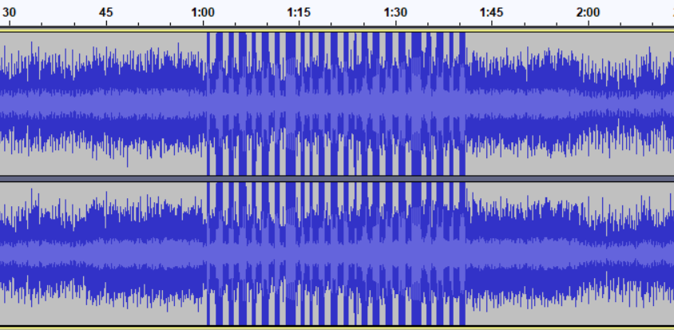
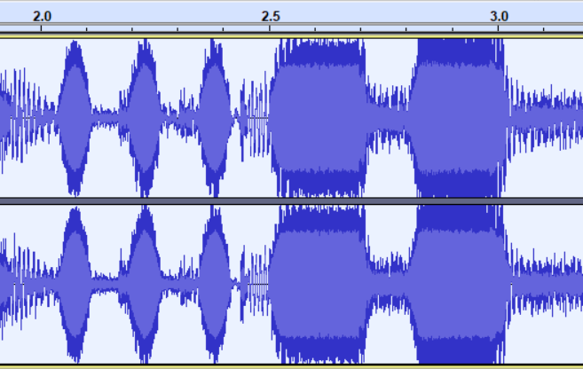

[< Back to All CTFs](https://github.com/KrisLloyd/Python/tree/master/CTF#ctf-solves)

[< Back to BIT Olympics CTF](https://github.com/KrisLloyd/Python/tree/master/CTF#bit-olymipcs-march-2021)
***

# Whats The Code


### Challenge:
##### Give up
##### 150 Points
##### Files: [give_up.wav](give_up.wav)

### Solve:

My first thought was that the flag was hidden in the metadata of the wav file. I used an online tool *Metadata2go*, however the metadata didnt seem to provide any useful content.

I then decided to load the file into the audio program *Audacity* where I noticed that there was a significant amount of distortion at the 1 minute mark. 



Zooming in on the distortion, it appeared to resemble Moris code, where short tones represented dots and longer tones the dashes. Using an online Moris code translator (https://morsecode.world/international/translator.html), this revealed the flag..



```
-. ...-- ...- ...-- .-. -...- --. ----- -. -. ....- -...- --. .. ...- ...-- -...- -.-- ----- ..- -...- ..- .--.
```

```
N3V3R=G0NN4=GIV3=Y0U=UP
```

### Flag
```
flag{N3V3R=G0NN4=GIV3=Y0U=UP}
```
