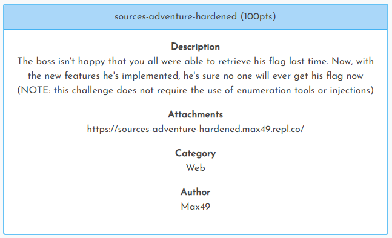
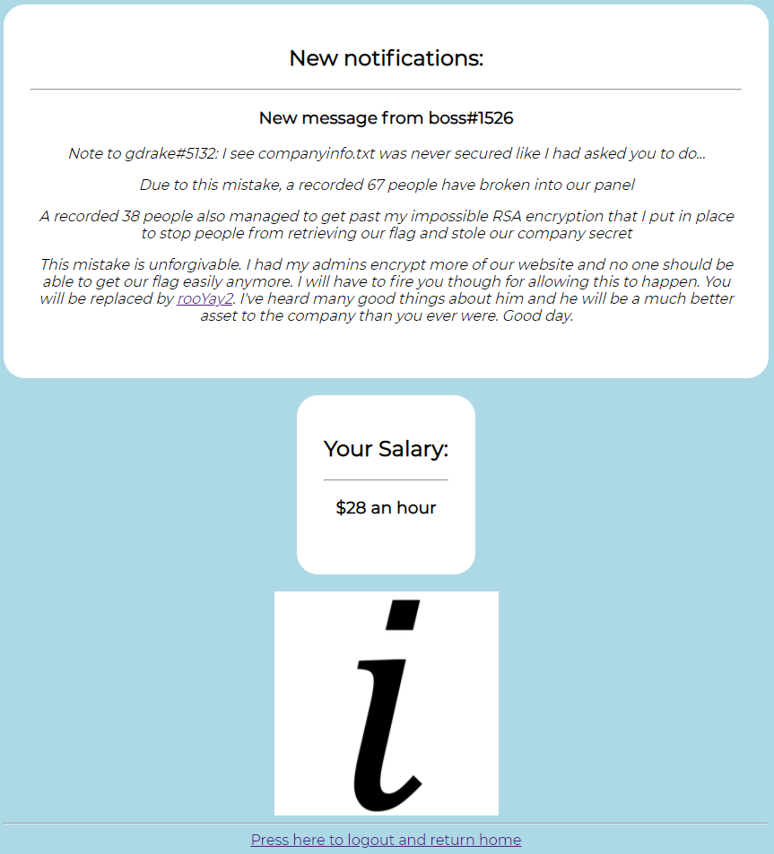
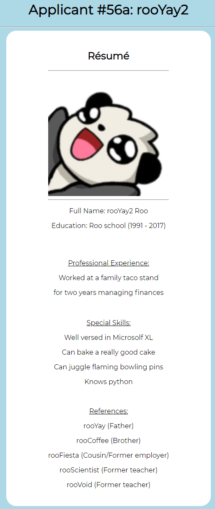
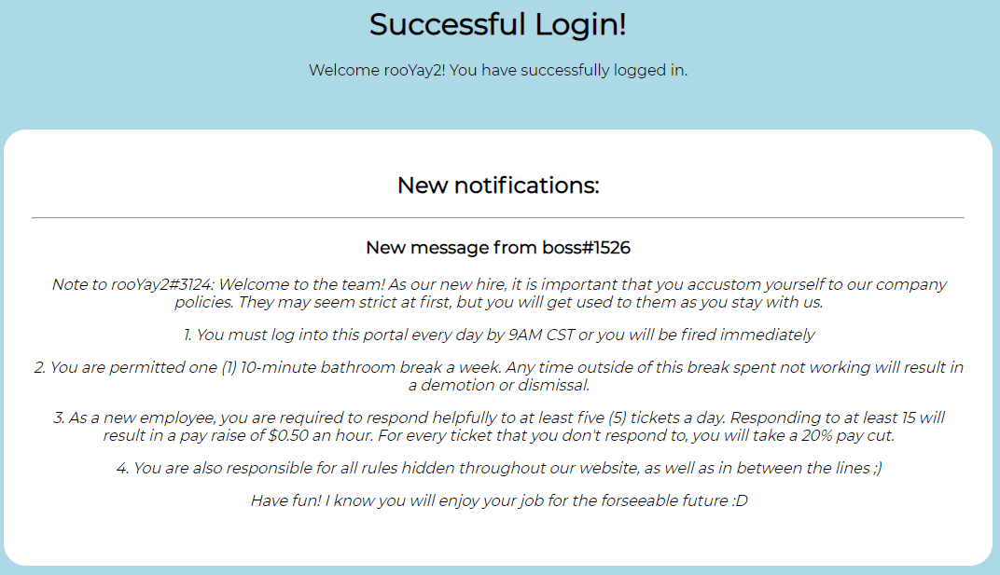
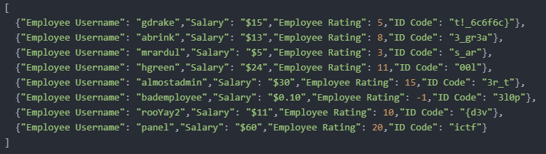

[< Back to All CTFs](https://github.com/KrisLloyd/Python/tree/master/CTF#ctf-solves)

[< Back to Imaginary CTF](https://github.com/KrisLloyd/Python/tree/master/CTF#imaginary-ctf-ongoing-2021)
***

# sources-adventure-hardened



### Challenge:
##### The boss isn't happy that you all were able to retrieve his flag last time. Now, with the new features he's implemented, he's sure no one will ever get his flag now.
##### 100 Points
##### Attachments: https://sources-adventure-hardened.max49.repl.co/

### Solve:

Using the link provided, it brings you to an employee login page for a fictional company, ICTF. Inspecting the page source give an interesting series of comments:

```html
<!--- finally figured out how to hide logins.txt boss -->
<!--- the logins are now stored in a much safer place -->
<!--- where are they stored now? -boss -->
<!--- I don't want to reveal the exact location just in case we're being tracked, but the file can't be requested by search engine crawlers anymore, making it SUPER secure ;) -->
<!--- Good work admin! This will be reflected in this month's paycheck -->
<!--- thanks boss -->
```

Web crawlers, this automatically points me towards the sites robots.txt file.

```html
User-agent: *
Disallow: /classified_info
```

The robots.txt file identifies which directories and files that a web crawler should ignore when crawling. Looks like there is a directory called **/classified_info**, let's take a look.

```html
Employee Login Information:

"gdrake": "empl0y33_2",
"abrink": "g00d_emp10y33",
"mrardul": "I_Love_Roos",
"hgreen": "ruth123",
"almostadmin": "Pa$$w0rd10",
"bademployee": "getting_fired_tomorrow"
```

Looks like the admin didn't secure the information that well afterall. Let's see if we can login using some of these accounts.

The checking the accounts for the accounts provided some interesting information. Upon login, there are several alert messages that pop up before the page laods:

```
Welcome back to our website!

We're planning on removing this spam feature in the future

We enjoy annoying our employees though

What do you think about the alert spam 
{ INPUT BOX }

Great! We will definitely send over your response and your response definitely is stored somewhere

Enjoy the panel!
```

The alert messages seem interesting, I'm sure there's something to dig into there, especially the input box.

Finally the landing page resembles the following for all users. The name and salary changes between users, but the messages are always the same. There is also a link to the resume page for **rooYay2** found at /rooYay2



The Resume page looks like:



Hovering over the profile picture revels the following text:

```
My favorite emoji is rooNoBooli and cookies are my favorite snack!
```

Inspecing the source, there are some interesting comments:

```html
<!-- rooYay2 will be hired. Make his employee password his favorite emoji please. It will be easier for him to remember (case sensitive) -->
<!-- also create a custom employee portal for rooYay2 based on his interests please -->
```

Great! So now we have a new login to try:

```
rooYay2
rooNoBooli
```

Same alert messages, but we have a new portal page:



Looking into the page source, there is another interesting comment:

```html
<!-- <p>It's time for the sources adventure!</p>-->
```

Using developer tools, the sources tab revels **success.js**. I'm thinking this is where that allert input box comes into play.

```javascript
eval(function(p, a, c, k, e, d) {
    e = function(c) {
        return (c < a ? '' : e(parseInt(c / a))) + ((c = c % a) > 35 ? String.fromCharCode(c + 29) : c.toString(36))
    }
    ;
    while (c--) {
        if (k[c]) {
            p = p.replace(new RegExp('\\b' + e(c) + '\\b','g'), k[c])
        }
    }
    return p
}('X 6(){3 w="v u t";3 r="q\'s p o n 1 m k a j!";0("i h g 8 f!");0("4\'e d c b x 7 l y 1 A");0("4 W V 8 T S");3 Q=P("O N M L K 1 0 7","I 5 2 H");0("G! 4 E 9 D C 5 2 B 5 2 9 z F J");0("R 1 U!")};6();', 60, 60, 'alert|the|response|var|We|your|login|spam|our|definitely|last|removing|on|planning|re|website|to|back|Welcome|time|as|feature|same|be|gonna|not|It|haha||Intensifies|Herring|Red|info|this|in|is|future|and|over|send|will|stored|Great|here|Type|somewhere|about|think|you|do|What|prompt|review|Enjoy|though|employees|panel|annoying|enjoy|function'.split('|')))

```
Allowing the function to run generates the following string:

```
"function login(){var info="Red Herring Intensifies";var haha="It's not gonna be the same as last time!";alert("Welcome back to our website!");alert("We're planning on removing this spam feature in the future");alert("We enjoy annoying our employees though");var review=prompt("What do you think about the alert spam","Type your response here");alert("Great! We will definitely send over your response and your response definitely is stored somewhere");alert("Enjoy the panel!")};login();"
```

The string is then evaluated as a function and run:

```javascript
function login(){
  var info="Red Herring Intensifies";
  var haha="It's not gonna be the same as last time!";
  
  alert("Welcome back to our website!");
  alert("We're planning on removing this spam feature in the future");
  alert("We enjoy annoying our employees though");
  var review=prompt("What do you think about the alert spam","Type your response here");
  alert("Great! We will definitely send over your response and your response definitely is stored somewhere");
  alert("Enjoy the panel!")
};

login();
```

The input box saves our input into a variable named **review**, but it doesn't get used when the login() function is called. More investigation is needed past this point, however I had another option running in the background.

While this is running, I also ran GoDirbuster on the site.

```bash
gobuster dir -u https://sources-adventure-hardened.max49.repl.co/ -w /usr/share/wordlists/dirbuster/directory-list-2.3-medium.txt
===============================================================
Gobuster v3.0.1
by OJ Reeves (@TheColonial) & Christian Mehlmauer (@_FireFart_)
===============================================================
[+] Url:            https://sources-adventure-hardened.max49.repl.co/
[+] Threads:        10
[+] Wordlist:       /usr/share/wordlists/dirbuster/directory-list-2.3-medium.txt
[+] Status codes:   200,204,301,302,307,401,403
[+] User Agent:     gobuster/3.0.1
[+] Timeout:        10s
===============================================================
2021/04/28 12:20:34 Starting gobuster
===============================================================
/http%3A%2F%2Fwww (Status: 301)
/payroll (Status: 200)
/http%3A%2F%2Fyoutube (Status: 301)
/http%3A%2F%2Fblogs (Status: 301)
/http%3A%2F%2Fblog (Status: 301)
/**http%3A%2F%2Fwww (Status: 301)
/http%3A%2F%2Fcommunity (Status: 301)
/http%3A%2F%2Fradar (Status: 301)
/http%3A%2F%2Fjeremiahgrossman (Status: 301)
/http%3A%2F%2Fweblog (Status: 301)
/http%3A%2F%2Fswik (Status: 301)
===============================================================
2021/04/28 12:47:11 Finished
===============================================================
```

This pointed to the /payroll directory which was hosting the file **payrollinformationictf.json**:

[payrollinformationictf.json](payrollinformationictf.json)



From this json file, the flag was visible in the **ID Code** variable for each user.


While this method most likely wasn't the intended solve, it got the answer (and got it significantly faster then the *proper* method). I may revisit the actual solve in the future.


### Flag
```
ictf{d3v3l0p3r_t00ls_ar3_gr3at!_6c6f6c}
```
